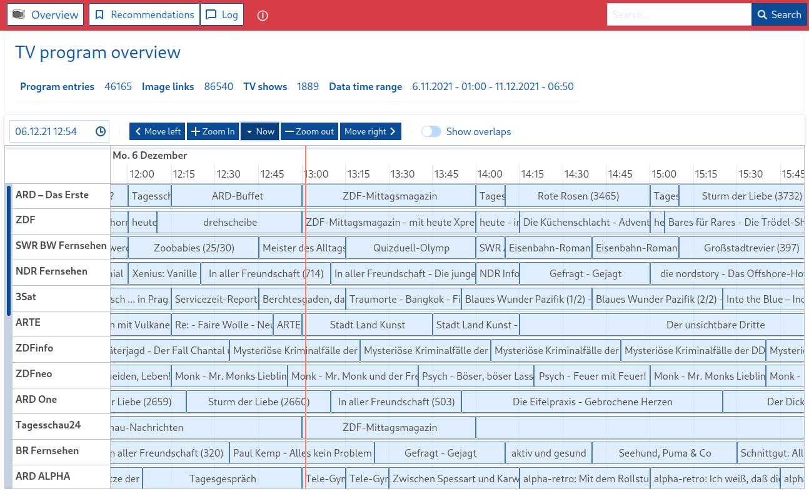
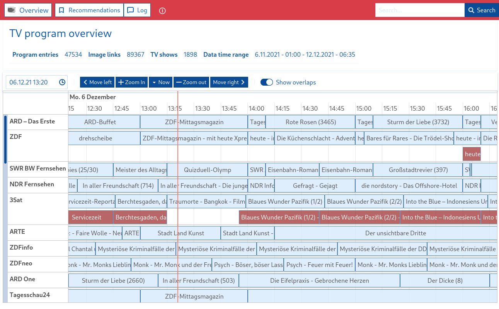
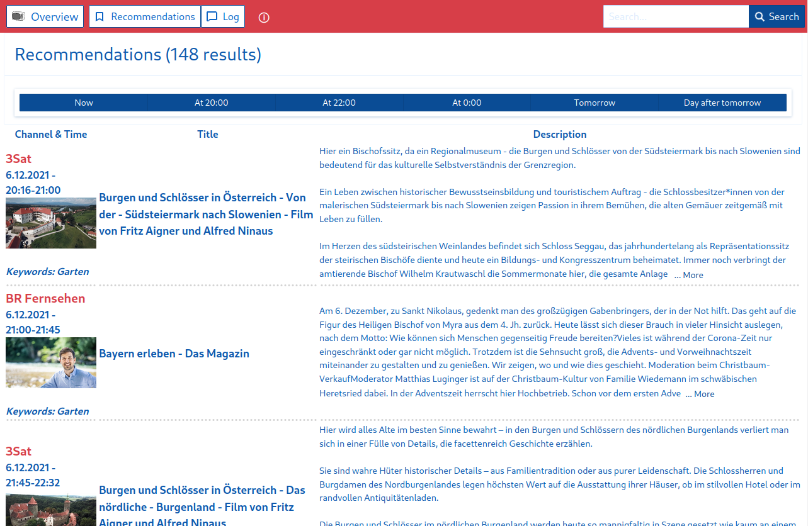

# OERC

... is a software project to locally store, view and search the program data of
public-law ("öffentlich-rechtliche") TV stations in Germany, Austria and Switzerland.

`oerc` needs a single PostgreSQL database and some configuration options to get ready.

While `oerc` is a command-line tool only, a built-in web application is provided for you
at `127.0.0.1:8080` (*default*) if you run `oerc server`.

### Commands

- **Collecting TV program data** of 28 TV channels (`oerc fetch`)
- **Search for interesting program** items by looking for your own keywords (`oerc search`)
- Running an **HTTP server** to access program data in a simple Web-UI (`oerc server`)
- By default, the server contains a small **client web application** for your browser to view the program data and
  your personal program recommendations

With the help of `oerc` you can build and use your own private TV program recommendation tool while ALL
information is processed and kept locally.

This project is written in Golang, and it is *AGPL v3* licensed. You are encouraged to participate and improve
functionality.
[Just create a GitHub issue!](https://github.com/emschu/oerc/issues)

The focus of this project lies in providing program data for individuals - ready to be enriched, searched or analysed
as long as there is no (real) Open Data policy of the public-law sector.

At the moment it's not intended to create links between program data and Media(thek) information.
If you are looking for this have a look at [similar projects](#similar-projects).

*Note 1:* This server and client software is not ready to be used directly in the internet without further changes.
It is recommended to use it locally only or in protected environments and don't expose it to the internet.

*Note 2*: Unfortunately the public-law web pages this software needs to access are restricted to certain geographic IP
regions in general.

**Current software quality: Beta**


### Web Client





# Setup & Run

## Download and start
Download the `oerc` binary from [here](https://github.com/emschu/oerc/releases) for your platform,
make it executable, and you are ready to start.

## With docker/docker-compose

Clone this repository, and build the binary file for the container:
```bash
$ CGO_ENABLED=0 ; GOOS=linux ; GO111MODULE=on go build -o bin/oerc-release -ldflags "-s -w"
```
Then:
```bash
$ docker-compose build
$ docker-compose up
```

## Manual Installation

1. To obtain this application use the following command

```shell
go install github.com/emschu/oerc@latest
```

2. Set up a PostgreSQL database (12+), configure a database with a user and start it.
    - The development section contains a simple docker command to run a local database for development and
3. Run `oerc init`.   
   - This will copy a sample configuration file to the path `~/.oerc.yaml` - if the file does not exist already.
   You have to change some of the values in order to get `oerc` to work, at least you have to replace `<db_name>`,
   `<db_user>`, `<db_password>` in the configuration file to reach the database you've configured in the previous step.
4. Run `oerc fetch` for the first time and wait until the first program data is collected for you.
5. Run `oerc server` to have a browser application at `http://localhost:8080/client` (the endpoint is configurable).
6. Run `oerc search` to look for recommendations based on your self-defined keywords in the configuration.

## Description

```text
NAME:
   oerc - Command line tool to manage the oerc application

USAGE:
   oerc [global options] command [command options] [arguments...]

VERSION:
   0.14.0, License: AGPLv3, https://github.com/emschu/oerc

DESCRIPTION:
   Fetch, view and search TV program data of public-law stations in Germany, Switzerland and Austria

COMMANDS:
   clear               Clear the database. Be careful!
   fetch, f            Get latest data
   fetch-range, fr     Fetch a specific date range
   full-overlap-check  Run overlap check on all program entries. Could take very long.
   init, i             Initial database and configuration setup check
   overlap-check       Run overlap check on currently fetched time range
   search, sc          Search program data and create recommendations
   server, sv          Start webserver with oerc API and an embedded browser client
   status, s           Show some of the app's status information
   help, h             Shows a list of commands or help for one command

GLOBAL OPTIONS:
   --config value, -c value  Path to the yaml configuration file (default: ~/.oerc.yaml)
   --verbose                 Verbose log output (default: false)
   --help, -h                show help (default: false)
   --version, -v             print the version (default: false)                                                            
```

### Configuration options

The following preferences are important to understand your possibilities to control this software.
You can find this file [here](./config/.oerc_default.dist.yaml) and if you run `oerc init` this file will be created at
`~/.oerc.yaml` for you. You *must* provide valid postgres database connection details.

If you don't want to put your configuration at the user's home directory, you can also use the
`-c <path-to-your-oerc>.yaml`
argument for all `oerc` commands.

```yaml
# db settings
DbType: postgres
DbHost: localhost
DbPort: 5432
DbName: <db_name>
DbSchema: public
DbUser: <db_user>
DbPassword: <db_password>
DbSSLEnabled: false
# general fetch settings
ForceUpdate: false
# don't update entries which were processed already in the last 6 hours
TimeToRefreshInMinutes: 360
# if you run "oerc fetch" the last 2 and the next 7 days of program data will be fetched
DaysInPast: 2
DaysInFuture: 7
# enable/disable channel families
EnableARD: true
EnableZDF: true
EnableORF: true
EnableSRF: true
EnableProgramEntryCollection: true
EnableTVShowCollection: true
# provide a full URL to a HTTP(S) or SOCKS proxy or it will fail
ProxyUrl:
TimeZone: Europe/Berlin
# backend server settings
ServerHost: 127.0.0.1
ServerPort: 8080
# client server settings
ClientEnabled: true
# search settings
# only search for recommendations in the next 4 days
SearchDaysInFuture: 5
# these are example values. Feel free to create your own list of keywords :)
SearchKeywords:
  - Loriot
# these channels won't be recognized during the "search" for recommendations based on your keywords
SearchSkipChannels:
  - KIKA
  - ORF Sport +
Debug: false
AccessControlAllowOrigin: "http://127.0.0.1:8080"
```

## Usage

After installing `oerc` and setting it up, you should run at least one time the `oerc fetch` command.

It is recommended to update the program data regularly, e.g. daily, by using a (unix) **cron job** which
runs `oerc fetch`
and `oerc search`.

While it is possible to run `oerc server` in a user session, you should consider to create a systemd
service to run and control the web server (backend + frontend) in the background persistently.

The following systemd service file is a simple example to integrate `oerc` with systemd in a Linux system:

**oerc.service:**

```
[Unit]
Description=oerc service
After=network.target

[Service]
Type=simple
ExecStart=<path_to_oerc_bin> server
StandardOutput=journal
KillMode=process

[Install]
WantedBy=multi-user.target
```

*Note*: You *must* replace `<path_to_oerc_bin>` with an absolute path to the `oerc` binary (`which oerc`).

Copy the modified system service templates to your systemd services directory, e.g. `/etc/systemd/system`, and reload the
systemd daemon by executing

`$ sudo systemctl daemon-reload`.

After the last command you can use

`$ sudo systemctl [start|stop] oerc`

to start (or stop) the services.

To (not) start the service on boot, type

`$ sudo systemctl [enable|disable] oerc`.

If you enable both services by default, please keep in mind that the PostgreSQL database needs
to be available too, so ensure to enable the postgres database service as well.

### Channel list

**Channels:** ARD, ZDF, 3Sat, ARTE, ZDFInfo, ZDFNeo, Phoenix, KiKa, ARD One, Tagesschau24, ARD Alpha, SWR RP Fernsehen,WDR Fernsehen, SWR BW Fernsehen,SR Fernsehen, Radio Bremen TV, RBB Fernsehen, NDR Fernsehen, MDR Fernsehen, HR Fernsehen, BR Fernsehen, ORF eins, ORF 2, ORF III, ORF Sport +, SRF-1, SRF-zwei, SRF-info.
### Time range import limits

| Channel family | Earliest date   | Latest date     |
|----------------|-----------------| --------------- |
| ARD            | ~ 2010/01       | Today + 6 weeks |
| ZDF            | 2015/03         | Today + 6 weeks |
| ORF            | Today - 14 days | Today + 22 days |
| SRF            | Today - 14 days | Today + 29 days |

## Project guidelines

- This project is non-commercial.
- Private/commercial sector TV or radio stations will *never* be part of this project.
- This project shall be an instrument mainly to analyze the program and constructively
  improve public-law TV and radio stations. Or just use it privately.
- This project would be superfluous, if there was a public API for public data, OpenData...
- Minimise traffic and external load to the least needed.
- Avoid security problems on the client side and maintain privacy of the users.
- All parts of the software should work on "low-resource" platforms, e.g. a Raspberry Pi 3b+

<a name="similar-projects"></a>

### Similar projects:

- [mediathekview/zapp-backend](https://github.com/mediathekview/zapp-backend)
- [MediathekView(Web)-Project](https://github.com/mediathekview)
- [MediathekDirekt](https://mediathekdirekt.de/) + [Sources](https://gitlab.com/mediathekdirekt/mediathekdirekt)

### OpenApi 3 specification

If you run the (backend) server (`oerc server`) an OpenApi 3 specification is shipped at
`http://localhost:8080/spec/openapi3.json`, respectively `.yaml`. Or have a look at the
API specification files in [this directory](./docs).

## License

This project is licensed under [GNU Affero General Public License 3](./LICENSE).

```text
oerc, alias oer-collector
Copyright (C) 2021-23 emschu[aet]mailbox.org

This program is free software: you can redistribute it and/or modify 
it under the terms of the GNU Affero General Public License as 
published by the Free Software Foundation, either version 3 of the 
License, or (at your option) any later version.

This program is distributed in the hope that it will be useful, 
but WITHOUT ANY WARRANTY; without even the implied warranty of 
MERCHANTABILITY or FITNESS FOR A PARTICULAR PURPOSE. See the 
GNU Affero General Public License for more details.

You should have received a copy of the GNU Affero General Public 
License along with this program. 
If not, see <https://www.gnu.org/licenses/>.
```

### Used libraries

- [Urfave/cli v2](https://github.com/urfave/cli/) – CLI is a simple, fast, and fun package for building command line
  apps in Go.
- [Gorm](https://gorm.io/) – The fantastic ORM library for Golang
- [Colly](http://go-colly.org/) – Fast and Elegant Scraping Framework for Gophers
- [Gin](https://github.com/gin-gonic/gin) – Gin is a HTTP web framework
- [Bluemonday](https://github.com/microcosm-cc/bluemonday) – A fast golang HTML sanitizer

## Development

This project is shipped with a `Makefile` to ease the development and testing process.
At first you should run `make setup` and you need the usual Golang/Python/Node/Java toolchains.
Be sure to run `make build` and `make spec` (if you updated something there) before filing a pull request.

### Database

#### Development postgresql container

```console
# docker run --name oer-postgres -p 5432:5432 -e POSTGRES_PASSWORD=root -e POSTGRES_DB=oer_server_dev -d postgres:13.5-alpine 
```

### Contributing

- File issues on GitHub to request and discuss new features or bugs there.
- You need a new feature/improvement? -> File an issue.
- Contribute code through pull requests or submit patch files.

## More information

- [German] [Die Vermessung des TV-Programms auf datenjournalist.de](https://www.datenjournalist.de/die-vermessung-des-tv-programms/)